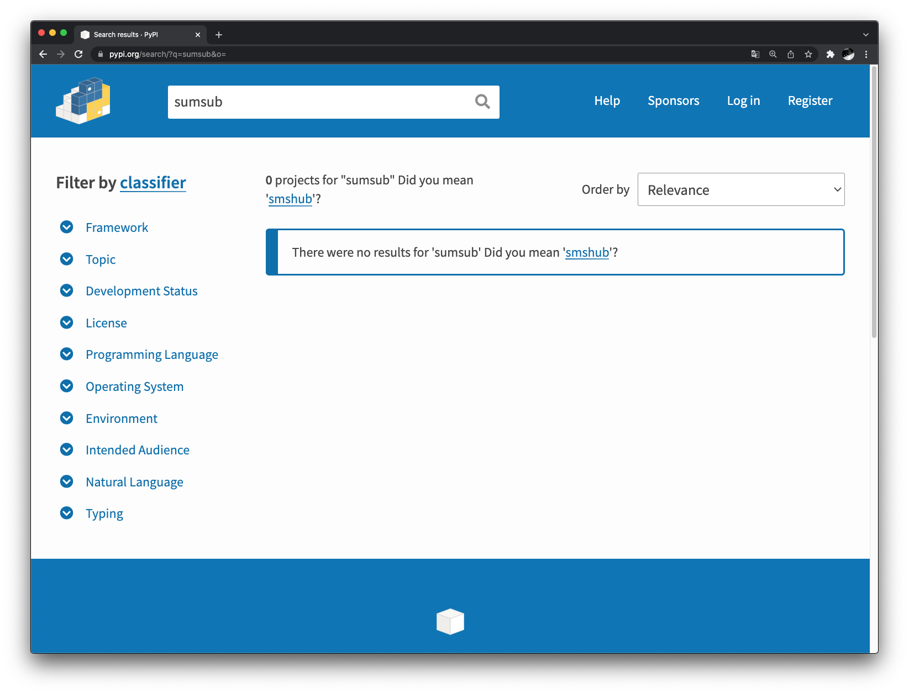
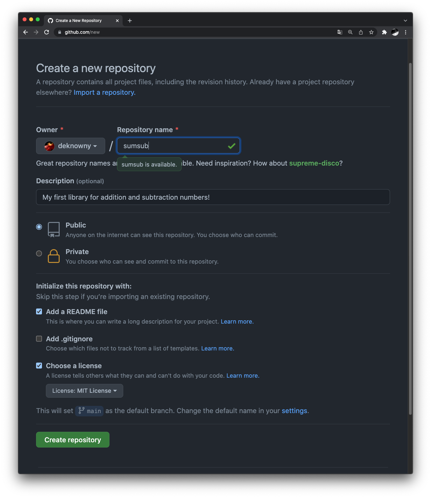

# 1) Come up with library name
Firstly, you need think about library name. Keep in mind that your name should be unique and does not exist yet. We will call it `sumsub` but you should think about your own. You can check that your name is still free on PyPI search panel.

!!! Note
    Try avoiding such parts in library name such as `lib` or `py`. Anyone who will see or use `:::python import <your-name>` already knows that it is a library for python. Name should be short and sensed.

    Also by PEP8 library name should not contain underscores (`_`)




# 2) Install `cookiecutter`
Secondly, make sure you have installed the latest version of  `cookiecutter`
```
python -m pip install --upgrade cookiecutter
```
!!! FAQ
    Cookiecutter is project templating tool allows creating "copies" by a template files structure and template strings inside the project so for best experience we allow you configured some parameters like project name, description, etc. and it easily can be done with `cookiecutter`

Now you are ready to create your own library! __Remind__ you in this tutorial we are going to create a library that summarize and subtract numbers.

# 3) Create a remote repository
Your library code will be hosted on a remote repository (GitHub preferred). So now we should create it



# 4) Create a project by the template
This command will create a directory with your library code. Execute this in a directory you want the project will exist
```shell
cookiecutter gh:deknowny/python-package-template -o .
```

!!! Missing
    If you get an error like `command cookiecutter cannot be found`
    try executing `python -m cookiecutter gh:deknowny/python-package-template -o .`


You will be asked some prompts


!!! Question
    If you see a prompt like `Is it okay to delete and re-download it?` press ++enter++

* `project_name`: Provide project name here (we will set it to `Sum Sub Library`)
* `project_slug`: Press ++enter++ if it's okay. It will be used as PyPI package name so make sure it's unique! (we will use `sumsub`)
* `project_description`: Provide project description. (we will set it to `My first library for addition and subtraction numbers!`)
* `author_name`: Provide you full name here
* `author_email`: Provide your valid email
* `development_python_version`: As you prefer (we will use `3.9`)
* `min_supported_version`: We just add functions for summarize and subtract numbers. `3.6` will be okay
* `github_project_name`: Provide GitHub project name. It concatenated with your GitHub username and repository name. If your username is `janedoe` and library name is `mylib` enter `janedoe/mylib` here
* `github_main_branch`: Recommend to use `main`, but if you have an old version of Git and `master` is often used by you, keep it for your convenience
* `docs_uri`: ++enter++. We will use GitHub pages for deploy

We will discuss every field more deeply later when the field has straight influence on what we are doing at the moment

# Execute firstly_init.py
Check out that directory with your `project_slug` is created and files are successfully generated by the template.

